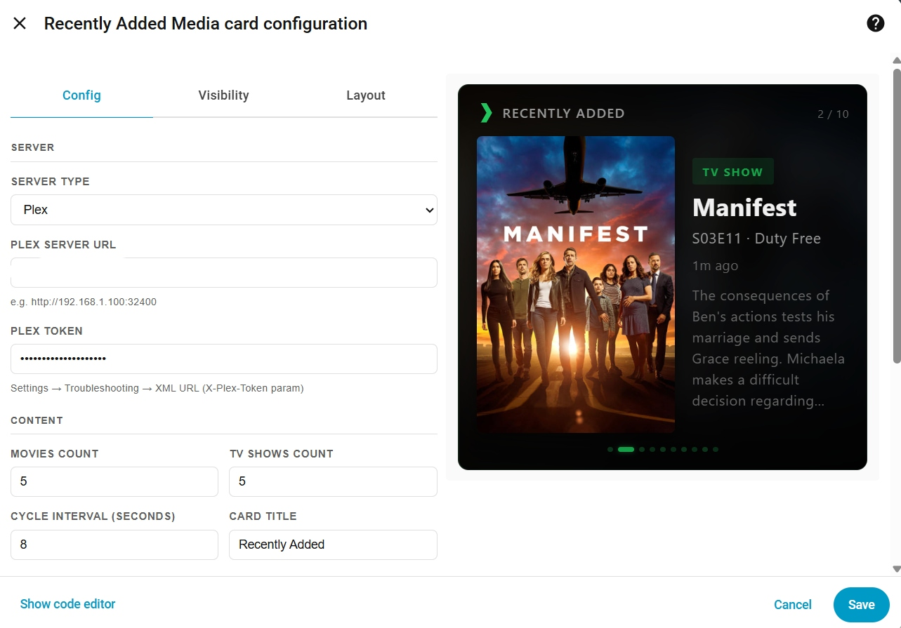
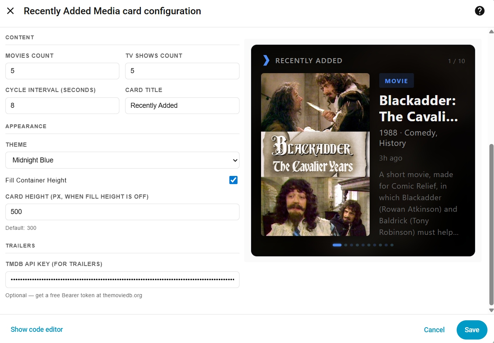

# Recently Added Media Card

A cinematic Home Assistant card that displays recently added movies and TV shows from **Plex**, **Kodi**, **Jellyfin**, or **Emby** — all in one card.

<p align="center">
  
</p>

> **v2.0.0** — This card unifies and replaces the previous standalone cards ([plex-recently-added-card](https://github.com/rusty4444/plex-recently-added-card), [kodi-recently-added-card](https://github.com/rusty4444/kodi-recently-added-card), [jellyfin-recently-added-card](https://github.com/rusty4444/jellyfin-recently-added-card), [emby-recently-added-card](https://github.com/rusty4444/emby-recently-added-card)) into a single card with a server type selector, themed accents, inline trailer playback, and swipe navigation.

---

## Features

- **Multi-server support** — Plex, Kodi, Jellyfin, and Emby, selected from a dropdown in the visual editor
- **Inline trailer playback** — trailers play directly inside the card (not a popup overlay), powered by the YouTube IFrame API
- **Themed accents** — each server type has its own default colours and logo, plus selectable colour presets (Midnight Blue, Sunset, Forest, and more)
- **Swipe navigation** — swipe left/right on touch devices or click-and-drag on desktop to move through the carousel
- **Cinematic design** — blurred background art, poster on left, info on right, smooth crossfade transitions
- **Auto-cycling carousel** — rotates through recently added items with colour-coded dots (movie/TV)
- **Synopsis and metadata** — title, year, genres, content rating, star rating, time since added, and full synopsis
- **Visual editor** — configure everything from the HA UI with dynamic fields per server type
- **Fill height / fixed height** — adapts to any HA layout mode
- **TMDB trailers** — fetches trailers for movies and TV shows via TMDB API (optional)

### Inline Trailers

Click the **Trailer** button and it plays right inside the card:

<p align="center">
  
</p>

### Visual Editor

The editor dynamically shows the right config fields based on your server type:

<p align="center">
  
  
</p>

---

## Install via HACS (Recommended)

1. Open **HACS** in Home Assistant
2. Click the **three dots** menu (top right) → **Custom repositories**
3. Paste `https://github.com/rusty4444/recently-added-media-card` and select **Dashboard** as the category
4. Click **Add**
5. Search for **Recently Added Media Card** in HACS → **Download**
6. Refresh your browser (Ctrl+Shift+R)

## Install Manually

1. Download `recently-added-media-card.js` from the [latest release](https://github.com/rusty4444/recently-added-media-card/releases)
2. Copy it to `/config/www/recently-added-media-card.js`
3. Go to **Settings → Dashboards → Resources** and add:
   - URL: `/local/recently-added-media-card.js`
   - Type: JavaScript Module
4. Refresh your browser

---

## Configuration

Search for the card by name in the **Add Card** dialog — the visual editor lets you configure everything without writing YAML.

Or add a **Manual card** with YAML (examples below for each server type).

### Plex

```yaml
type: custom:recently-added-media-card
server_type: plex
plex_url: http://YOUR_PLEX_IP:32400
plex_token: YOUR_PLEX_TOKEN
movies_count: 5
shows_count: 5
cycle_interval: 8
title: Recently Added
tmdb_api_key: YOUR_TMDB_READ_ACCESS_TOKEN  # Optional: enables trailers
```

### Kodi

```yaml
type: custom:recently-added-media-card
server_type: kodi
kodi_url: http://YOUR_KODI_IP:8080
kodi_username: kodi        # Optional
kodi_password: kodi         # Optional
movies_count: 5
shows_count: 5
cycle_interval: 8
title: Recently Added
tmdb_api_key: YOUR_TMDB_READ_ACCESS_TOKEN
```

### Jellyfin

```yaml
type: custom:recently-added-media-card
server_type: jellyfin
jellyfin_url: http://YOUR_JELLYFIN_IP:8096
jellyfin_api_key: YOUR_JELLYFIN_API_KEY
jellyfin_user_id: YOUR_JELLYFIN_USER_ID
movies_count: 5
shows_count: 5
cycle_interval: 8
title: Recently Added
tmdb_api_key: YOUR_TMDB_READ_ACCESS_TOKEN
```

### Emby

```yaml
type: custom:recently-added-media-card
server_type: emby
emby_url: http://YOUR_EMBY_IP:8096
emby_api_key: YOUR_EMBY_API_KEY
emby_user_id: YOUR_EMBY_USER_ID
movies_count: 5
shows_count: 5
cycle_interval: 8
title: Recently Added
tmdb_api_key: YOUR_TMDB_READ_ACCESS_TOKEN
```

---

## Options

| Option | Type | Default | Description |
|--------|------|---------|-------------|
| `server_type` | string | **Required** | `plex`, `kodi`, `jellyfin`, or `emby` |
| `plex_url` | string | — | Plex server URL (e.g., `http://192.168.1.100:32400`) |
| `plex_token` | string | — | Plex authentication token |
| `kodi_url` | string | — | Kodi JSON-RPC URL (e.g., `http://192.168.1.100:8080`) |
| `kodi_username` | string | — | Kodi username (if authentication is enabled) |
| `kodi_password` | string | — | Kodi password |
| `jellyfin_url` | string | — | Jellyfin server URL (e.g., `http://192.168.1.100:8096`) |
| `jellyfin_api_key` | string | — | Jellyfin API key |
| `jellyfin_user_id` | string | — | Jellyfin user ID |
| `emby_url` | string | — | Emby server URL (e.g., `http://192.168.1.100:8096`) |
| `emby_api_key` | string | — | Emby API key |
| `emby_user_id` | string | — | Emby user ID |
| `movies_count` | number | `5` | Number of recently added movies to display |
| `shows_count` | number | `5` | Number of recently added TV shows to display |
| `cycle_interval` | number | `8` | Seconds between cycling to the next item |
| `title` | string | `"Recently Added"` | Header text (set to empty string to hide) |
| `theme` | string | `"auto"` | Colour theme: `auto`, `plex`, `kodi`, `jellyfin`, `emby`, `dark`, `midnight`, `sunset`, `forest` |
| `tmdb_api_key` | string | — | TMDB Read Access Token — enables the trailer button |
| `fill_height` | boolean | `true` | When enabled, card stretches to fill its container. Disable if the card appears collapsed |
| `card_height` | number | `300` | Card height in pixels (only used when `fill_height` is `false`) |

---

## Finding Your Credentials

### Plex Token
1. Sign in to the Plex Web App
2. Browse to any media item
3. Click **Get Info** → **View XML**
4. The token is in the URL as `X-Plex-Token=XXXXX`

### Kodi JSON-RPC
1. In Kodi, go to **Settings → Services → Control**
2. Enable **Allow remote control via HTTP**
3. Set the port (default 8080) and optionally a username/password
4. The URL is `http://YOUR_KODI_IP:8080/jsonrpc`

### Jellyfin API Key
1. Go to your Jellyfin dashboard → **Administration → API Keys**
2. Create a new API key
3. For your User ID, go to **Administration → Users**, click your user, and copy the ID from the URL

### Emby API Key
1. Go to your Emby dashboard → **Advanced → API Keys**
2. Create a new API key
3. For your User ID, go to **Users**, click your user, and copy the ID from the URL

### TMDB API Key (for trailers)
1. Create a free account at [themoviedb.org](https://www.themoviedb.org/signup)
2. Go to [API Settings](https://www.themoviedb.org/settings/api)
3. Copy the **Read Access Token** (the long `eyJ...` string, not the short API Key)

---

## Themes

The `theme` option controls the accent colours used for badges, dots, ratings, and highlights.

| Theme | Primary Accent | Description |
|-------|---------------|-------------|
| `auto` | Based on server type | Default — matches Plex/Kodi/Jellyfin/Emby colours |
| `plex` | Gold (#e5a00d) | Plex's signature gold |
| `kodi` | Blue (#1da1f2) | Kodi blue |
| `jellyfin` | Purple (#aa5cc3) | Jellyfin purple |
| `emby` | Green (#52b54b) | Emby green |
| `dark` | Grey (#888888) | Neutral dark theme |
| `midnight` | Deep blue (#4a9eff) | Midnight blue accents |
| `sunset` | Orange (#e07c3e) | Warm sunset tones |
| `forest` | Green (#4a8c5c) | Dark forest green |

---

## How It Works

The card connects directly to your media server's API from the browser and fetches recently added content:

- **Plex**: Discovers library sections, then fetches recently added items from each movie and TV show library
- **Kodi**: Uses JSON-RPC to call `VideoLibrary.GetRecentlyAddedMovies` and `VideoLibrary.GetRecentlyAddedEpisodes`
- **Jellyfin**: Calls the `/Users/{userId}/Items/Latest` endpoint filtered by movie and series types
- **Emby**: Same approach as Jellyfin with Emby's API endpoints

Items are interleaved (movie, show, movie, show...) and displayed in a cycling carousel with smooth crossfade transitions.

### Important Notes

- The card makes API calls **from the browser**, not from the HA server. Your media server URL must be reachable from the device viewing the dashboard.
- If HA is served over **HTTPS** and your media server is on plain **HTTP**, browsers will block the requests (mixed content). Either access both over HTTPS, or use Plex's built-in `.plex.direct` HTTPS URLs.
- For **CORS issues** behind a reverse proxy (e.g., Nginx Proxy Manager), add `Access-Control-Allow-Origin` headers to your proxy config.

---

## Swipe Navigation

On touch devices, swipe left or right on the card to move through items. On desktop, click and drag left/right. The auto-cycle timer resets after each swipe.

---

## Migrating from the Standalone Cards

If you're currently using one of the standalone cards (e.g., `plex-recently-added-card`), switching is straightforward:

1. Install this card via HACS or manually
2. Edit your existing card and change the type:
   ```yaml
   # Old
   type: custom:plex-recently-added-card
   
   # New
   type: custom:recently-added-media-card
   server_type: plex
   ```
3. All other config options (`plex_url`, `plex_token`, `movies_count`, etc.) stay the same
4. Optionally add a `theme` to customise the look

The standalone cards will continue to work but won't receive new features.

---

## Known Issues

- **Geo-restricted trailers**: Some trailers may show "Video unavailable — The uploader has not made this video available in your country." This is a YouTube/TMDB restriction and cannot be fixed by the card.
- **Mixed content (HTTPS/HTTP)**: If your HA is on HTTPS and your media server is on HTTP, browsers block the requests. Use HTTPS for both, or use Plex's `.plex.direct` URLs.

---

## Related

- [coming-soon-card](https://github.com/rusty4444/coming-soon-card) — Upcoming movies and TV episodes from Radarr and Sonarr
- [plex-now-showing](https://github.com/rusty4444/plex-now-showing) — Cinema-style "Now Showing" display for active Plex playback
- [kodi-now-showing](https://github.com/rusty4444/kodi-now-showing) — Now Showing for Kodi
- [jellyfin-now-showing](https://github.com/rusty4444/jellyfin-now-showing) — Now Showing for Jellyfin
- [emby-now-showing](https://github.com/rusty4444/emby-now-showing) — Now Showing for Emby

---

## Credits
- Built by Sam Russell - AI Used in development
- YouTube embed fix based on the approach from [loryanstrant/ha-youtubevideocard](https://github.com/loryanstrant/ha-youtubevideocard) — YouTube IFrame API for Home Assistant
- Trailer data from [The Movie Database (TMDB)](https://www.themoviedb.org/)
- Built for the Home Assistant community
